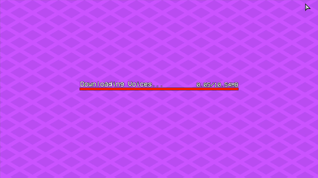
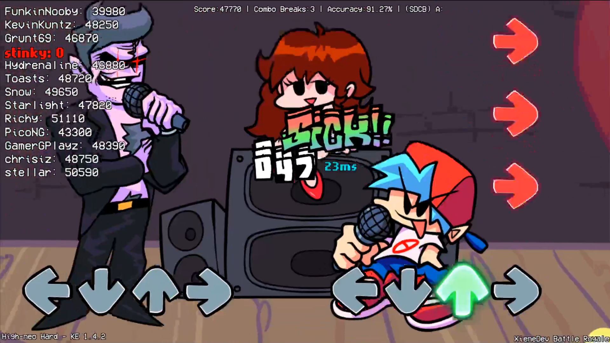
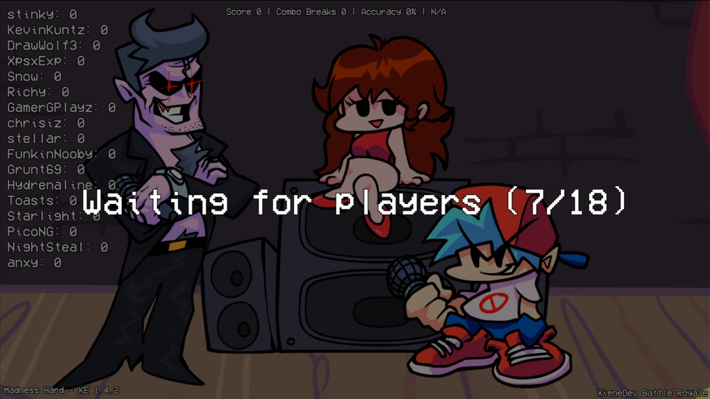
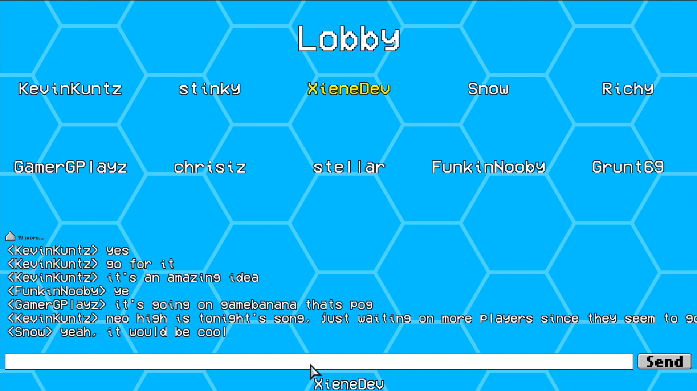
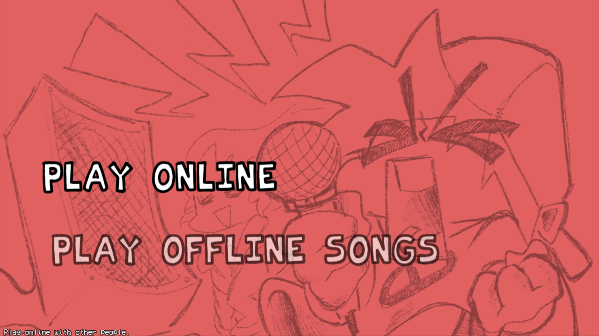
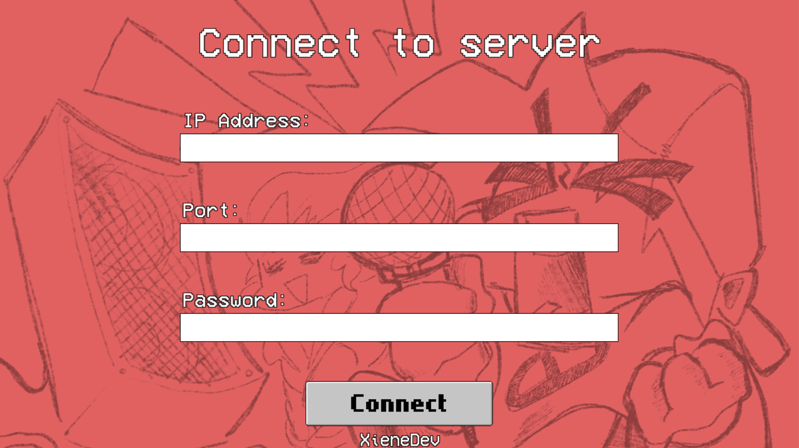

# Friday Night Funkin': Battle Royale

This is a mod for **Friday Night Funkin'** that lets you play with other people and compete to get high scores on real time, with support for custom songs that are downloaded automatically.

[**IF YOU WANT TO HOST A SERVER, READ THIS**](server/README.md)

Built on top of [Kade Engine](https://github.com/KadeDev/Kade-Engine) 1.4.2.

This mod only changes a couple of files from Kade Engine, so the source code doesn't contain the Kade Engine source code, nor does it fork it or something similar. To compile, you'll need to download the source code of the appropriate Kade Engine version and apply the source code of this mod on top of it. **If you just want to play, don't worry about this.**

# Screenshots ([skip](#Features))

# Features

- Chat system so you can talk to people in between rounds.
- Real-time score comparisons.
- Results screen after each round.
- Play custom songs that are downloaded over the internet (no extra work required).
- Change the number of safe frames (Kade Engine) for everyone from the server.
- Play offline the songs that you've downloaded.
- Ban & mute players.
- And more!

# Credits

### Friday Night Funkin'

- [ninjamuffin99](https://twitter.com/ninja_muffin99) - Programming
- [PhantomArcade3K](https://twitter.com/phantomarcade3k) and [Evilsk8r](https://twitter.com/evilsk8r) - Art
- [Kawai Sprite](https://twitter.com/kawaisprite) - Music

This game was made with love to Newgrounds and its community. Extra love to Tom Fulp.

### Kade Engine

- [KadeDeveloper](https://twitter.com/KadeDeveloper) - Maintainer and lead programmer
- [The contributors](https://github.com/KadeDev/Kade-Engine/graphs/contributors)

### Battle Royale Mod

- [XieneDev](https://www.youtube.com/c/XieneDev) - Programmer

# Other pages

- [Server info](server/README.md) - More info on how to host a server.
- [Building](https://kadedev.github.io/Kade-Engine/building) - How to compile/build the game. This points to the BUILDING.md inside the Kade Engine repository.
